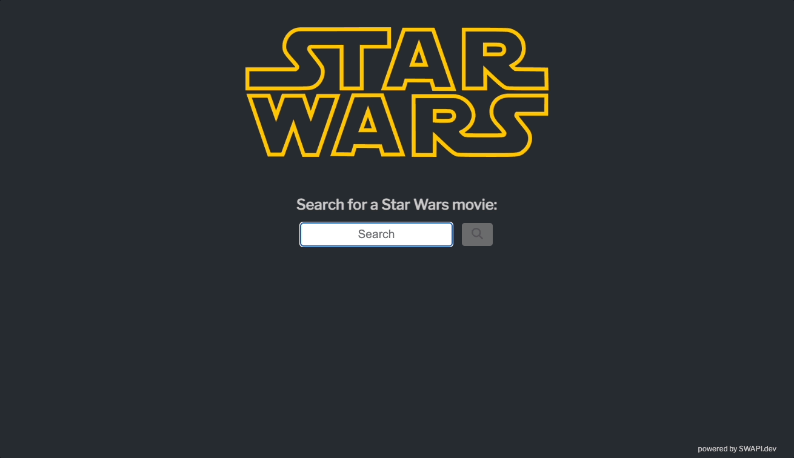

# Brave Challenge

The challenge is to create a single page React application that consumed the Star Wars API at swapi.dev. Search for Star Wars movies by title, display the results in a selectable list, and then display the details of the selection on a separate page using a state management library like Redux. Track code changes using Git, ensure app is responsive, and make any improvements deemed necessary for a better user experience.

## Brief explanation of my approach
1. Wireframe the project and create initial file & folder structure.
2. Add libraries that I plan to use:
    - [Axios](https://axios-http.com/): for making HTTP requests
    - [React Router](https://reactrouter.com/en/main): for page navigation
    - [Sass](https://sass-lang.com/): for styling
    - [DayJS](https://day.js.org/): for formatting date/time
    - [Redux](https://redux.js.org/): client-side state management
    - [React Loader Spinner](https://mhnpd.github.io/react-loader-spinner/): for loading screen spinner
    - [FontAwesome](https://fontawesome.com/): for icons
3. Use git branches to work on specific features (i.e. Search/Home page, Movie Details page, Redux state management, mobile responsiveness).
4. Establish base functionality first, then apply improvements to UI/UX.
5. Clean up & comment code for better readability.
6. Deploy app to Netlify: https://brave-challenge.netlify.app

## The Finished App
I found the SWAPI.dev API to be very limited in that it only returned text or number results and didn't include any media (it's also missing episodes 7-9). So I modified the search results to include some poster art in order to make the app a little more enjoyable to look at. I also added a little pop-up modal so that the user can view a larger version of the poster art. I made sure to include some error handling so that the user is presented with something informative on the screen should anything go wrong with the HTTP request, if state is lost upon page refresh, if they navigate to a non-existent page, or if the search returned no results.

